# Waterfall model

1. Requirements gathering and analysis
2. System design
3. Impleentation
4. Intergraion and troubleshooting
5. Deployment
6. Maintenance

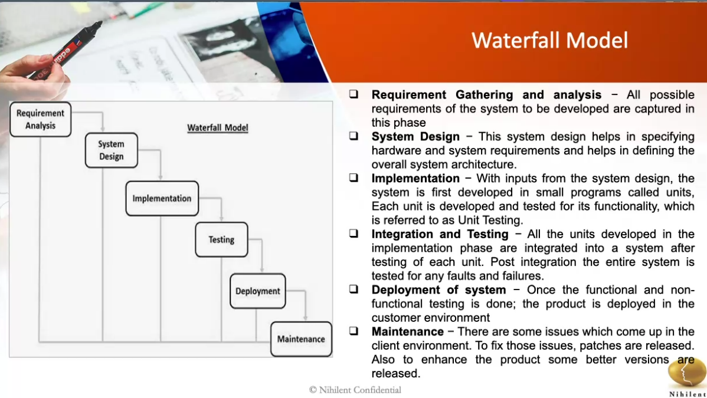

# Agile Methodology

- Iterative approach to project management and software development that helps teams deliver value to Customers
- 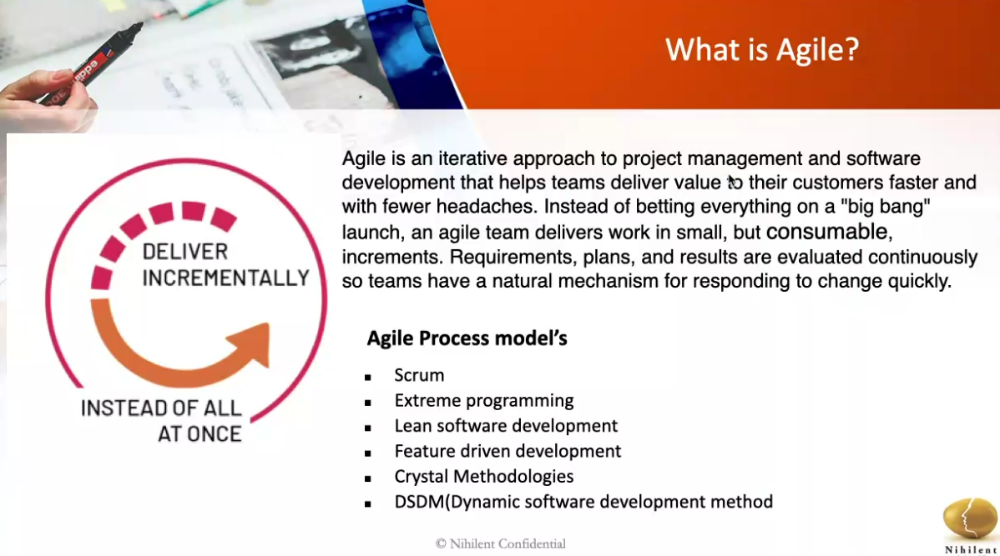
- 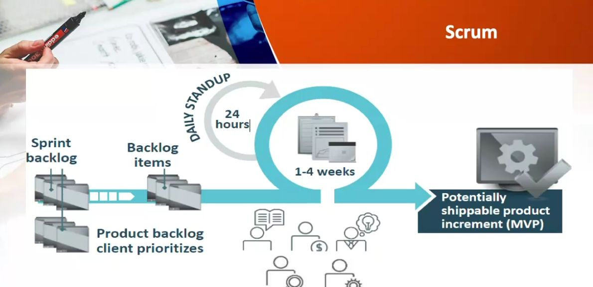
- 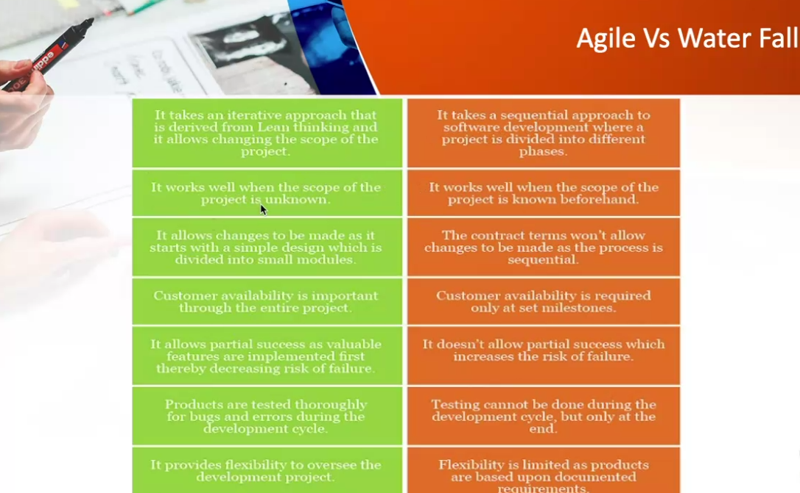

# What is DevOps

- Culture of collaboration between developers and operations people
- Process, set of standards to make your job more efficient
- Increased the rate of software delivery and the revenue for business stakeholders
  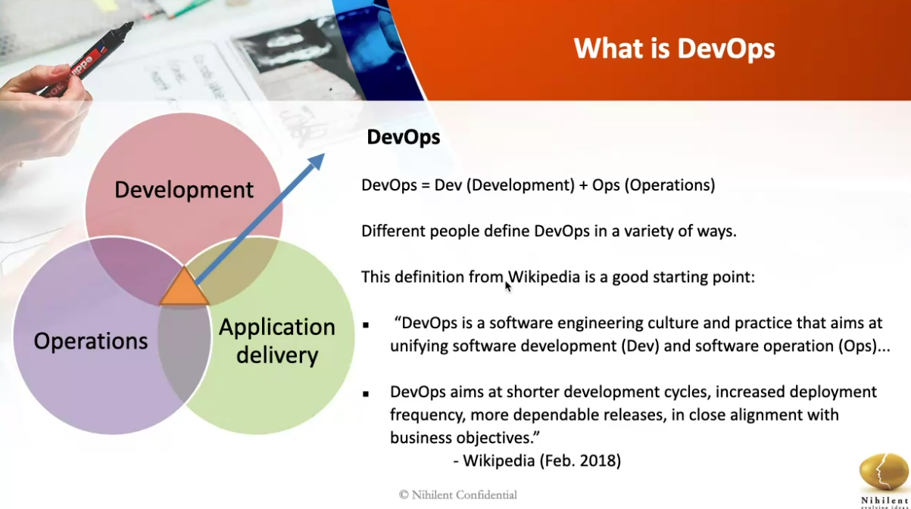
  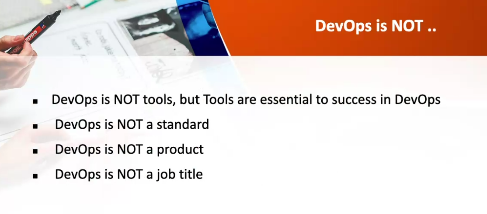
  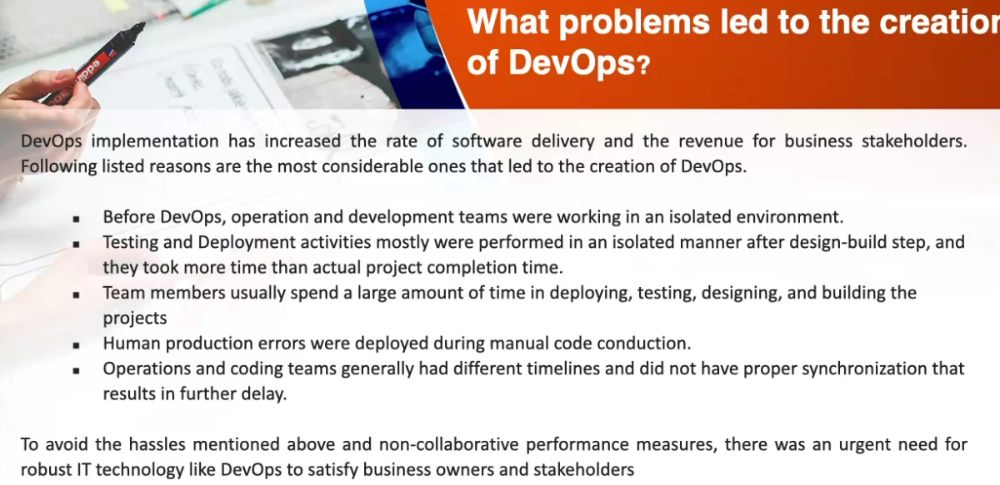
  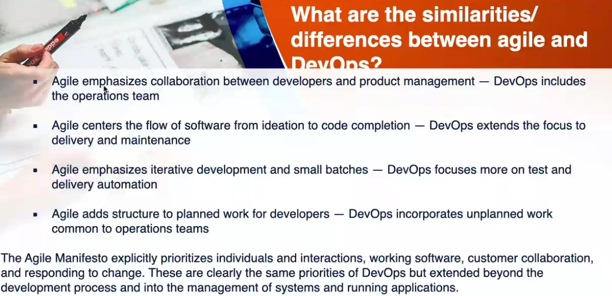
  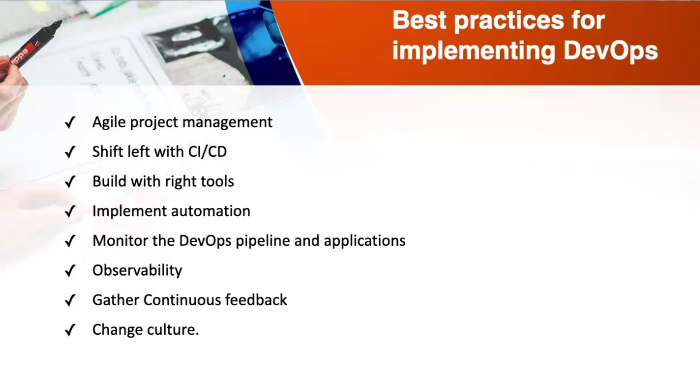
  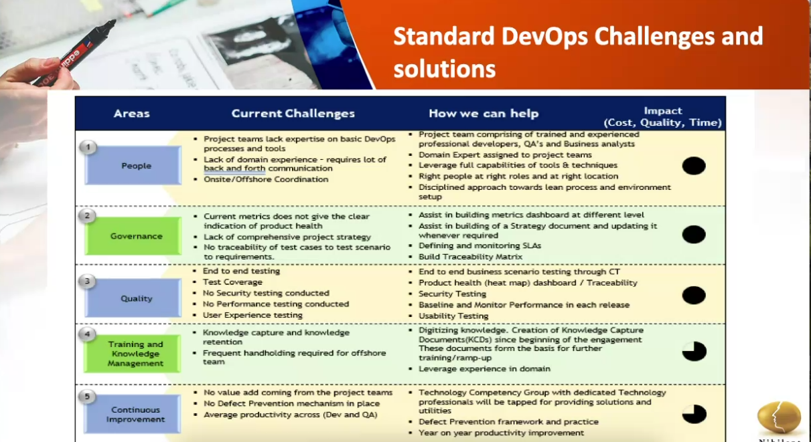
  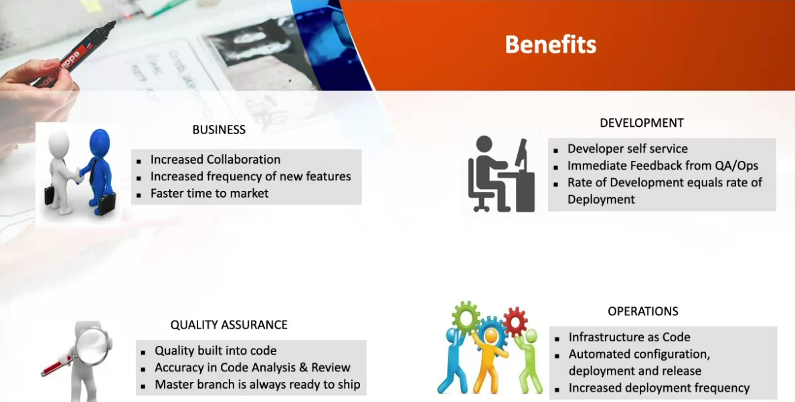
