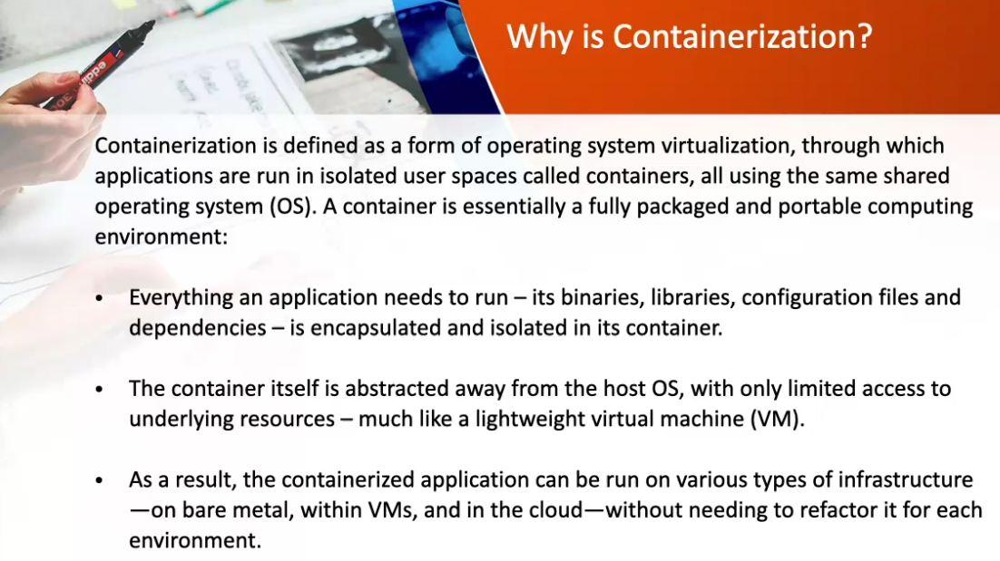

# Continous delivery vs Continous Deployment

- Delivery : more manual labour
- Deployment : more automated tasks
  
  
- Blue-green Deployment -> keep app in prod and create new version for Deployment -> route to new version
- 
- Canary Deployment -> update servers one-by-one -> you add one new server and push some users to that new server, if no bugs update another server etc
- 

## Continous Testing

- process of executing automated taests as part of the delivery pipeline
- Smoke test, rest test
- 
- 
- 
- 

## Infrastructure as a Code - Terraform

- Terraform is a tool for IaC
- used to maintain standardized code??
- 
- 
- 

## Configuration Management

- managing and changing the state of pieces of infrastructure in a consistent and maintainable way
- CM ttols are a great way to implement IaC
- Tools to maintain configuration of data -> ansible, puppet, chef, salt
- 

## Containerization

- Convert apps to run inside a container
- Convert Monolithic to microservices
- Done by developers
- 
- 
- 
- 
- 

## Security Development Lifecycle

1. Training - security training
   
2. Requirements - establish security requirement
   
3. Design - establish design requirements and analyse attack surface
   
4. Implementation - use approved/enterprise tools -> remove/delete unsafe functions
   
5. Verification -> verify no security leak -> review attack surface established when designing
   
6. Release -> establish incident response plan -> conduct final security review
   
7. Response ->

