Dev Sec Ops

- AWS Secure?
- Yes it is highly secure, experts, tools make it more secure

Ways to make it more secure

- web access firewall
- WAF helps stop attackers on the application level i.e SQL injections
- Security is a shared respomsibilty model
- Can i use aws waf to protect web sites not hosted in AWS ?
- Yes - you can use it indirectly because cloudfront can work on top of your server and then connect to WAF

DDOS Attack

- Use bots to send multiple request in order to overload website/system

AWS Shield

- Provides protection against DDOS attacks for apps running on AWS
- AWS Shield Standard
- 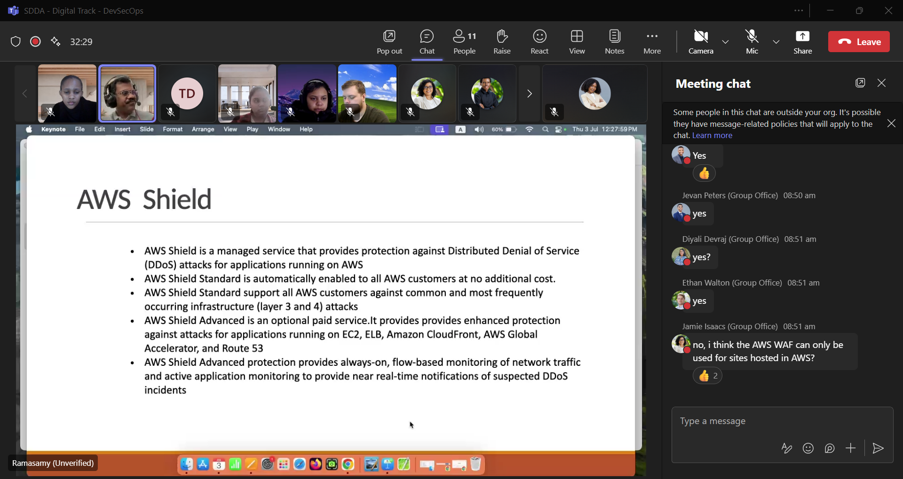

AWS Guardduty

- Threat detection service that continously monitor malicious activity and unathorized behavior
- Combones machine learning, anomaly detection, network monitoring and malicious file discovery, using both AWS and industry leading 3rd party sources
- Gives you accurate threat detection quickly

Data Encryption

- If hackers manage to access your data how to make it unreadable?
- Encryption store data in blind text/unreadable format
- All data in Amazon S3 are automatically encrypted
- # Server -side Encryption protects data at rest
- # Client-side encryption protects data at rest and transit

Encryption Methods

- Data at rest encryption (EBS, S3, RDS, Lambda etc)
- Key Management Service - AWS managed encryption keys or Customer managed/provided keys
- Hardware based cryptographic key storage (CloudSHM)
- encrypted message ques
- Data in transit using Secure Socket Layer Security (SSL/TLS)
- 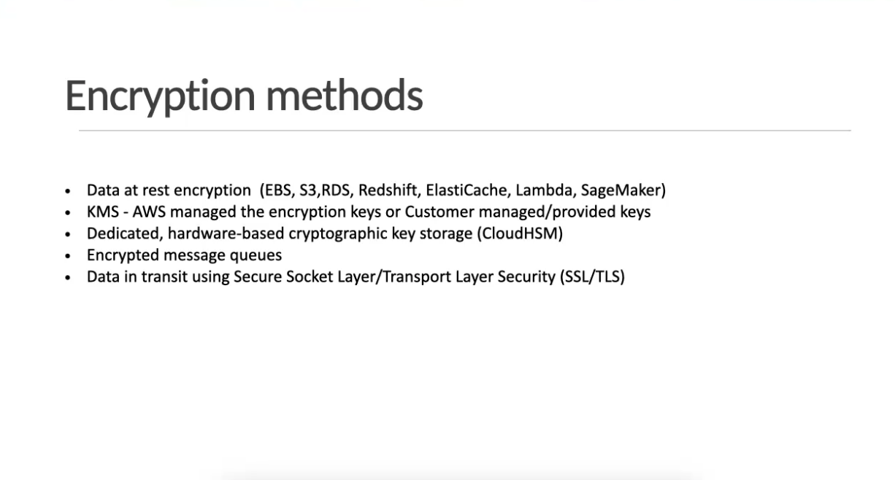

Can I use AWS KMS Key to encrypt data in

- no

Amazon S3 managed keys (SSE-S3)

- amazon creates key and manages it
  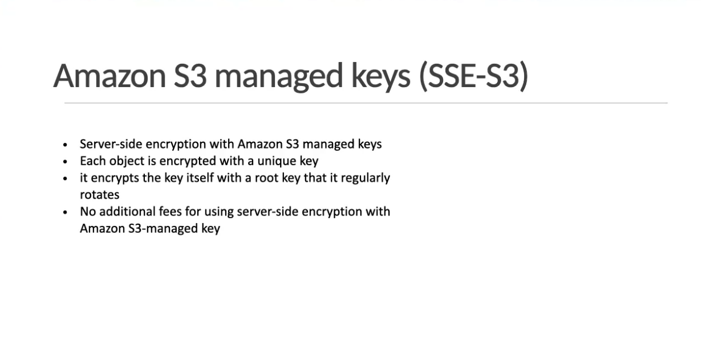

Customer provided keys (SSE-C)

- Customer creates key on 3rd party and AWS manages it
- 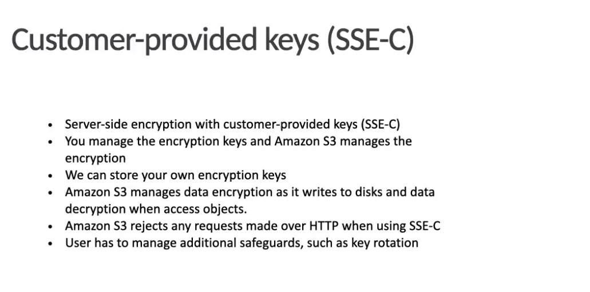

Envelope Encryption

- Two leves of encryption
- encrypts data and master key
  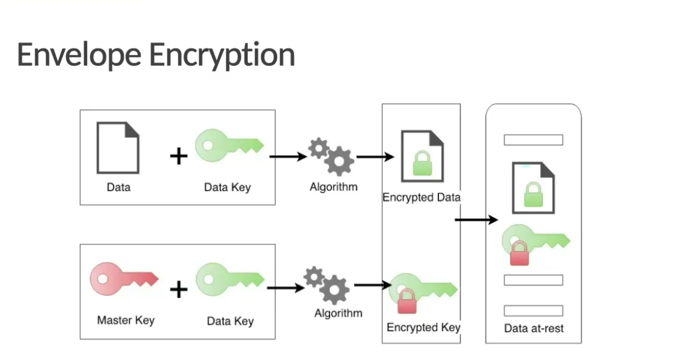

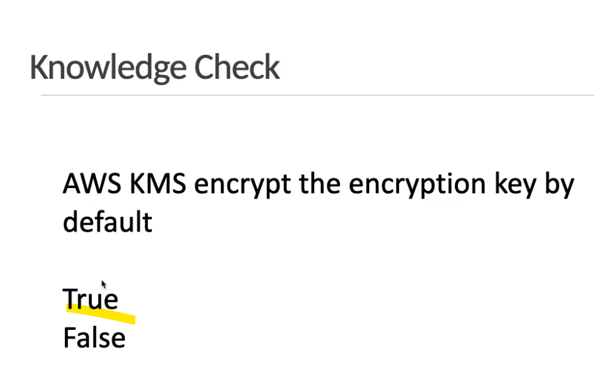

EBS Encryption

- by default it is not encrypted

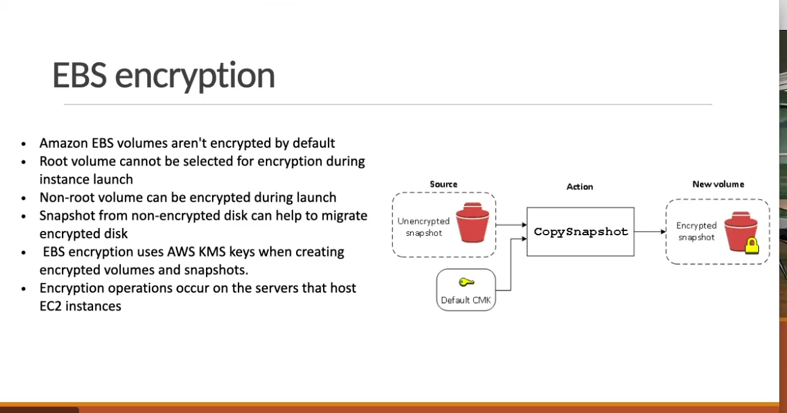

Can we create un-encrypted EBS volume from an encrypted snapshot

- No we cannot if original is encrypted then snapshot will be encrypted

Hardware Security Module - CloudSHM
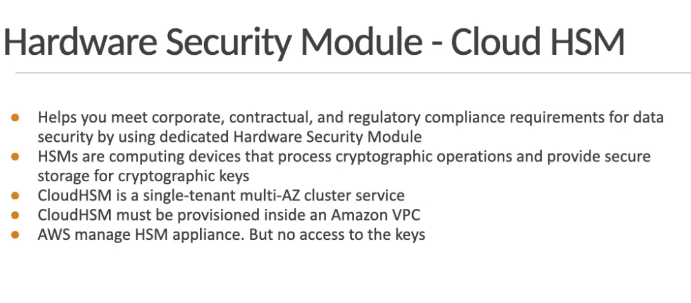

Does HSM can be placed at On-Premise

- No only accessed via AWS

* https is more secure ; http not secure as data is in plain text

Encryption in Transit
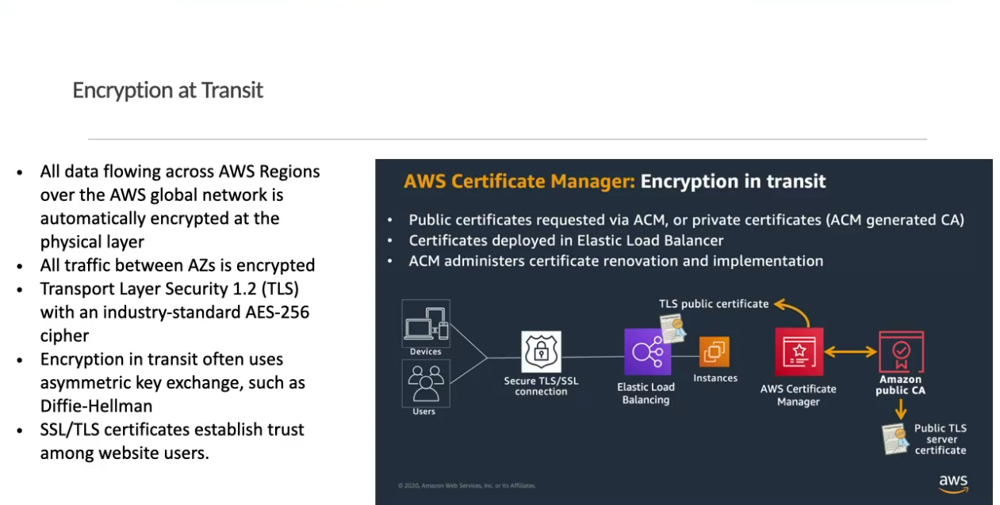

Can we attach both encrypted and unencrypted columes to an instance simoltaneously?

- Yes we can

Monolithic

- entrire code runs aas a single module
- each and every part of the code is highly intergrated
- even a small mistake will affect the whole code
- if you want to change anthig you need to stop the entire code
- troubleshooting will take a lot of time

Micro Services

- Break code into smaller managable bits of code
- to update you only stop a part of the code to update it

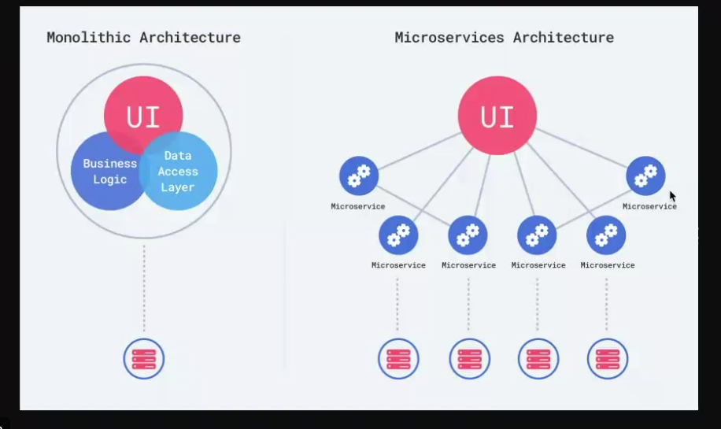

# Container Services

- Container tiny vms??
- used to run micro Service
- EC2 instance
- POD is used for network and allows communication
- POD is equivalent to vpc (network purposes)
- container runs insde the POD
- without a pod you cannot have a container
- purpose of containers is to be used when we have microservices, secondly,

Docker

- open source software that allows you to build docker image
- only helps to create

Docker image

- read only template that contains everything needed to run a Docker Container ike the blueprint or snapshot of your application environment
- code, libraries and dependencies
- stored in repository/artifact

# Elastic Container Service

- Exclusive to Amazon
- Fully managed by AWS
- simple apps
  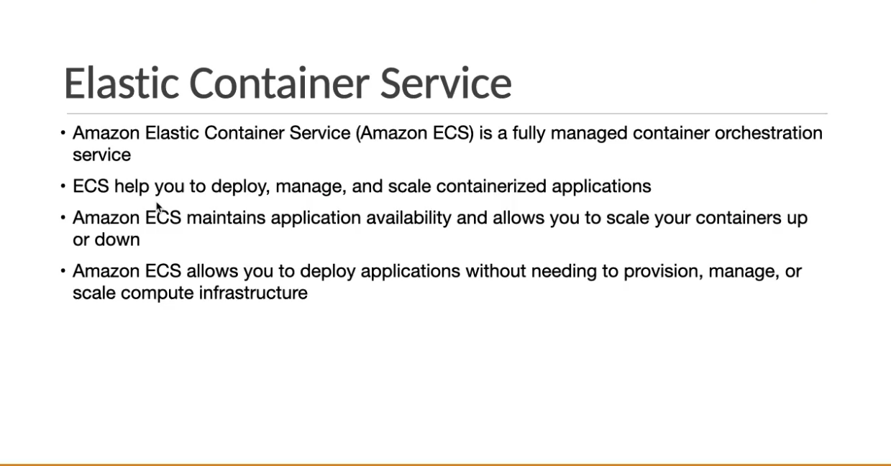

Elastic Kubernets Service

- Used by most cloud Services (open source)
- Can be used to migrate from different cloud service without changing code
- Partially managed, user is has flexibility
- complex apps
- ocherstration tool, it manages, monitor

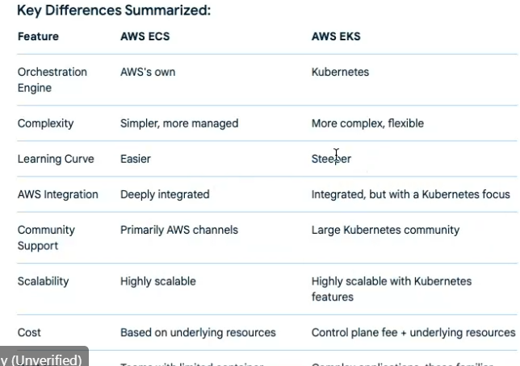
